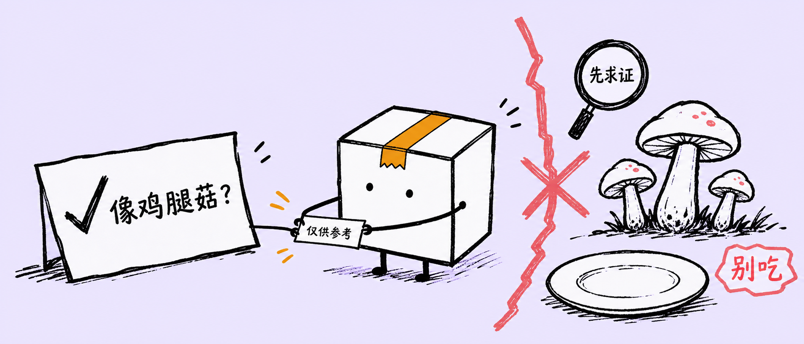
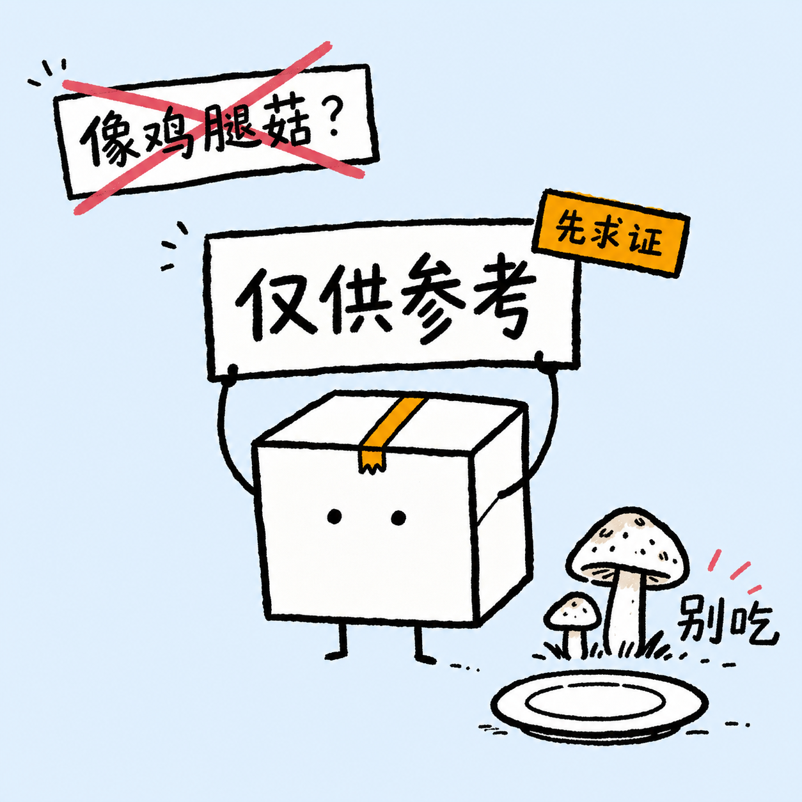

# 5km Littlebox Illustrations

> 把文章里的判断、流程、风险、方法和隐喻，变成一张张克制、怪诞、手绘感强的“小盒”正文配图。
>
> 16:9 横版为主 | 小盒 IP | 合盖纸盒小人 | 粗黑马克笔 | 浅天蓝 / 浅薰衣草紫背景 | Codex Skill

---

## 这个仓库是什么

`5km Littlebox Illustrations` 是一个 Codex Skill，用来指导 AI Agent 为中文文章、博客、产品思考、方法论笔记、热点评论和抽象概念生成正文配图。

它不是通用插画 prompt，也不是 PPT 信息图模板。它的目标是：先理解内容里的一个关键认知动作，再把它变成一张小盒正在“处理问题”的手绘解释图。

默认视觉 IP 是“小盒”：一个永远合盖的白色纸盒小人，正面三分之四视角，黑点眼睛，小短腿，两侧小细枝胳膊，顶部中央有一条琥珀色锯齿胶带。小盒不是可爱吉祥物，也不是装饰物，它必须承担画面里的核心动作。

一句话：**让 AI 不只是“配一张图”，而是把文章里的关键认知动作画出来。**

---

## 安装

使用 `skills` CLI 安装：

```bash
npx skills add okooo5km/5km-littlebox-illustrations
```

如果只想安装这个 Skill：

```bash
npx skills add okooo5km/5km-littlebox-illustrations --skill 5km-littlebox-illustrations
```

安装后，在 Codex 里使用：

```text
Use $5km-littlebox-illustrations 为这篇文章设计并生成 5 张小盒正文配图。
```

也可以先只做规划：

```text
Use $5km-littlebox-illustrations 先不要生成图片。
请分析下面这篇文章哪里值得配图，输出 5 张左右的 shot list。

<粘贴文章>
```

---

## 适合谁用

适合：

- 写中文文章，需要正文配图的人
- 做产品思考、AI 工作流、方法论内容的人
- 想把抽象判断画成具体隐喻的人
- 想要一个简洁、有识别度、可长期复用的原创 IP 风格的人
- 用 Codex 做内容生产，希望稳定复用一套视觉语言的人

不适合：

- 想要精致商业插画、品牌 KV 或儿童绘本风格的人
- 想要传统 PPT 信息图、复杂架构图或密集流程图的人
- 想做可爱贴纸、表情包或拟人吉祥物的人
- 想把大量正文、长句解释或完整课程页塞进一张图里的人
- 需要严格可编辑矢量源文件的人

---

## 它会产出什么

默认输出：

- 16:9 横版正文配图
- 一篇文章的 4-7 张 shot list
- 每张图的放置位置、核心意思、视觉隐喻、小盒动作和中文标注建议
- 最终 PNG 图片，保存到 workspace 的 `assets/<article-slug>-littlebox/`

默认不输出：

- PPTX / PDF / Keynote
- SVG / HTML / Canvas 可编辑图
- 商业海报或封面 KV
- 大段文字型信息图

---

## 视觉风格

这个 Skill 默认使用“小盒”手绘正文配图风格：

- 浅天蓝 `#E3F2FD` 或浅薰衣草紫 `#E6E6FA` 平面背景
- 黑色粗马克笔线条，干刷质感，边缘粗糙
- 小盒永远合盖，不开盖、不半开、不剖面
- 小盒白色盒身，黑点眼睛，小短腿，两侧小细枝胳膊
- 顶部中央只有一条琥珀色锯齿胶带
- 珊瑚红只用于警告、盖章、错误或强调
- 中文标签短、少、手写感强
- 大量留白，一张图只表达一个核心动作
- 小盒必须参与核心动作，不能只是站在旁边

---

## 示例效果

### 仅供参考，别当饭吃



### 先求证



这些图片是风格校准样例，不是构图模板。使用时应该从当前内容重新发明隐喻，不要照抄旧案例的物件和布局。

---

## 怎么用

### 只做配图规划

```text
Use $5km-littlebox-illustrations 先不要生图。
请分析下面这篇文章哪里值得配图，输出 5 张左右的 shot list。
每张图写清楚：
- 放在哪段后
- 主题
- 核心意思
- 小盒状态
- 视觉隐喻
- 建议元素
- 建议中文标注词

<粘贴文章>
```

### 直接生成正文配图

```text
Use $5km-littlebox-illustrations 把下面这篇文章生成 4 张小盒正文配图。
要求：16:9 横版、浅天蓝和浅薰衣草紫背景均衡、粗黑马克笔、少量琥珀色和珊瑚红中文手写标注。

<粘贴文章>
```

### 为单个概念生成一张图

```text
Use $5km-littlebox-illustrations 为这个观点生成一张正文配图：

信任不是一句口号，而是一包被保存好的小证据。

小盒必须承担核心动作，画面要怪诞但清楚。
```

### 为热点讽刺生成静态图

```text
Use $5km-littlebox-illustrations 为“AI 把概率答案说得太自信，而现实风险没人兜底”生成一张 21:9 静态讽刺图。
小盒保持合盖，用两侧小细枝胳膊把“仅供参考”从角落拽到中央。
```

更多示例见 [examples/prompts.md](examples/prompts.md)。

---

## 工作流程

这个 Skill 的流程是：

1. 读取文章、Markdown、截图、链接或用户给的主题
2. 提炼单个最强洞察、认知转折、流程结构或失败点
3. 先输出 shot list：每张图只选一个认知锚点
4. 为每张图选择浅天蓝或浅薰衣草紫背景，并保持多图数量均衡
5. 重新发明一个低科技、怪诞但成立的物理隐喻
6. 让小盒在合盖状态下承担核心动作
7. 每张图单独调用图像模型生成
8. 按 quality gate 检查：合盖、胶带、胳膊、留白、中文标注、非 PPT 感
9. 保存最终 PNG，并报告路径

---

## 目录结构

```text
.
├── README.md
├── LICENSE
├── NOTICE.md
├── examples/
│   ├── images/
│   │   ├── 01-ai-mushroom-satire-21x9.png
│   │   └── 02-ai-mushroom-satire-1x1.png
│   └── prompts.md
└── 5km-littlebox-illustrations/
    ├── SKILL.md
    ├── agents/
    │   └── openai.yaml
    └── references/
        ├── visual-language.md
        ├── littlebox-ip.md
        ├── composition-methods.md
        ├── language-and-labels.md
        ├── prompt-template.md
        ├── quality-gate.md
        └── examples.md
```

真正需要安装到 Codex 的是子目录：

```text
5km-littlebox-illustrations/
```

根目录的 README、LICENSE、NOTICE 和 examples 是 GitHub 分享文档。

---

## 注意事项

- 小盒必须合盖。不要开盖、半开、剖面或露出内部。
- 琥珀色胶带只能作为小盒顶部中央身份胶带，不能乱贴到盒身或其他物体上。
- 小盒的胳膊必须从两侧盒缝伸出，不能从正面、眼睛或盖子长出来。
- 图片里的中文文字越短越稳定。
- 每张图只讲一个核心结构，不要把文章做成说明书。
- 小盒必须承担核心动作；如果去掉小盒画面仍然完全成立，说明小盒太装饰了。
- 示例图只用于校准线条密度、留白、颜色克制和小盒参与方式，不要复刻构图。
- AI 图像模型可能出现错字、幻觉标签、风格漂移或多余标题，生成后需要检查。
- 如果中文错字严重，优先减少标注词并重生成。

---

## 作者

**okooo5km（十里）**

- GitHub: [okooo5km](https://github.com/okooo5km)

