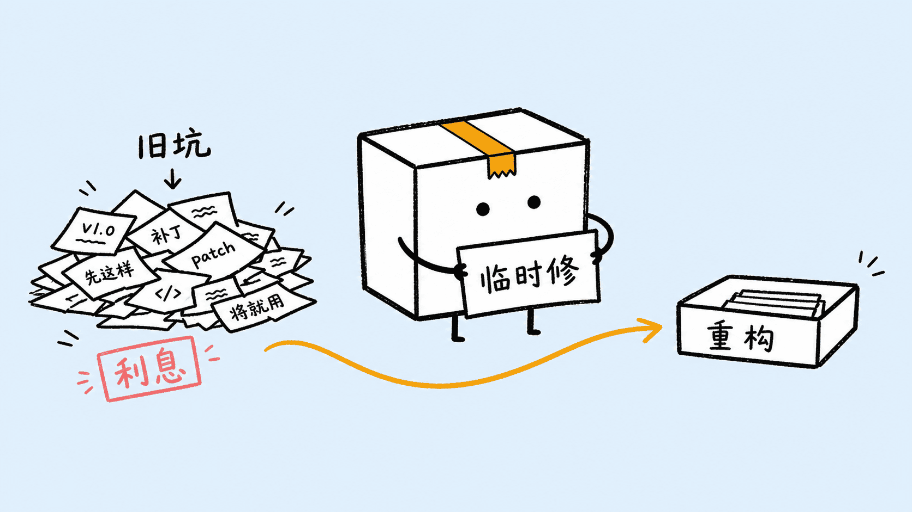
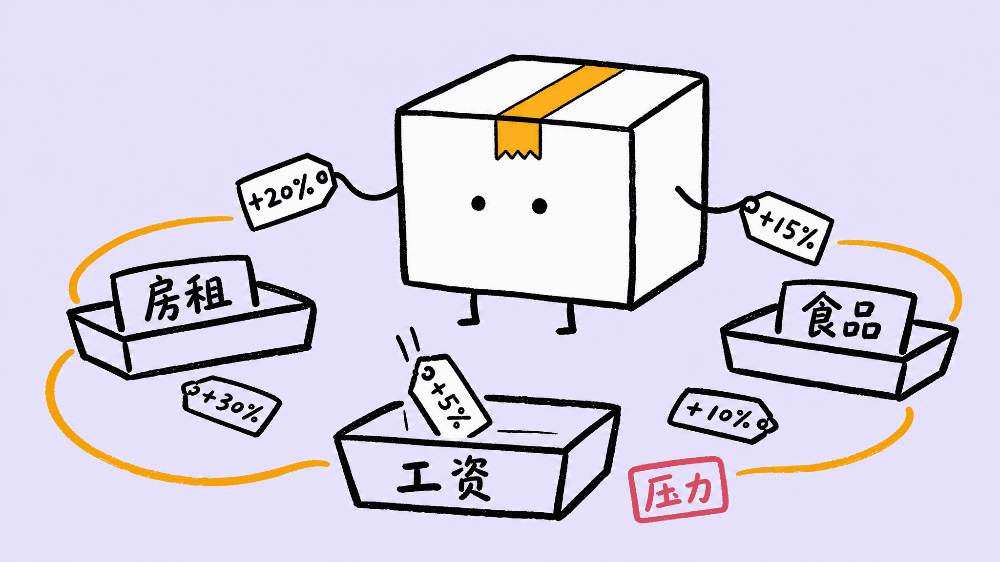
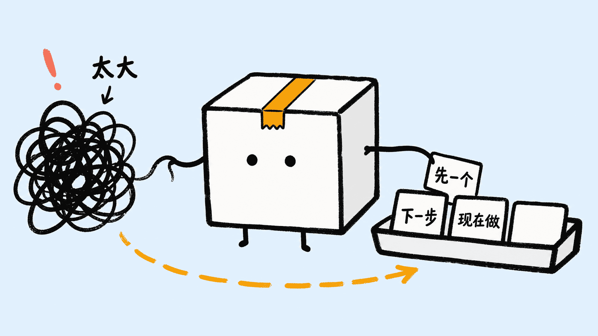
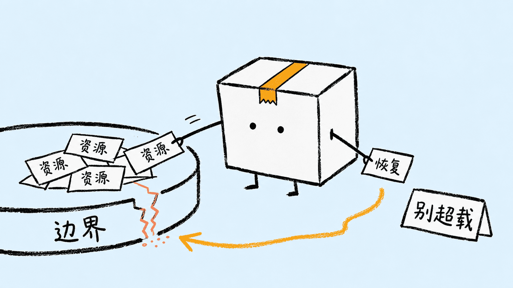
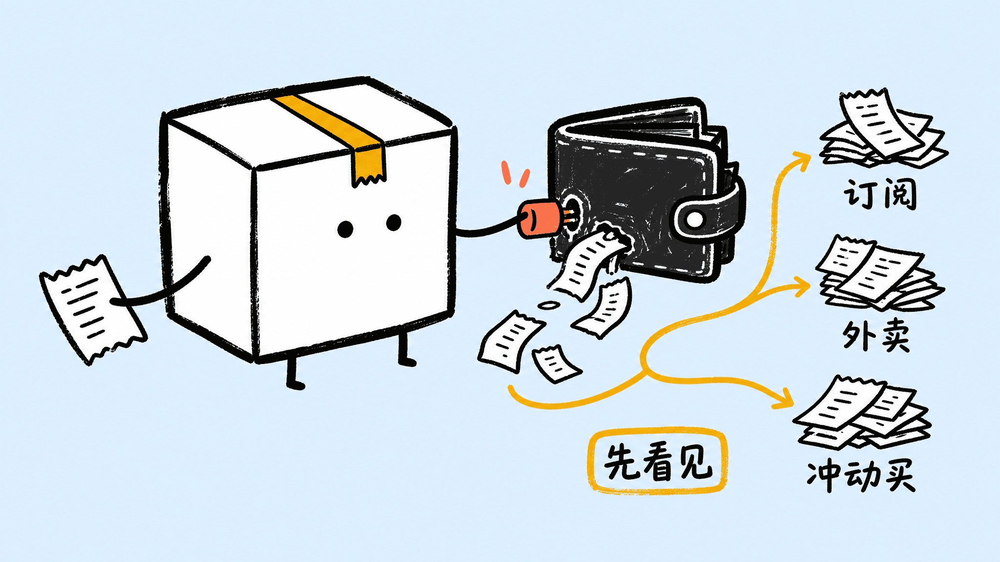
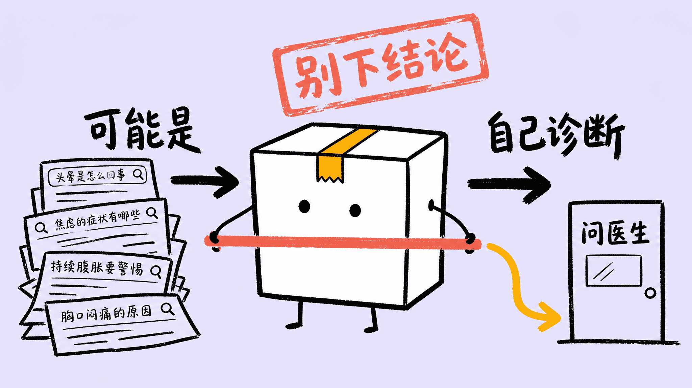
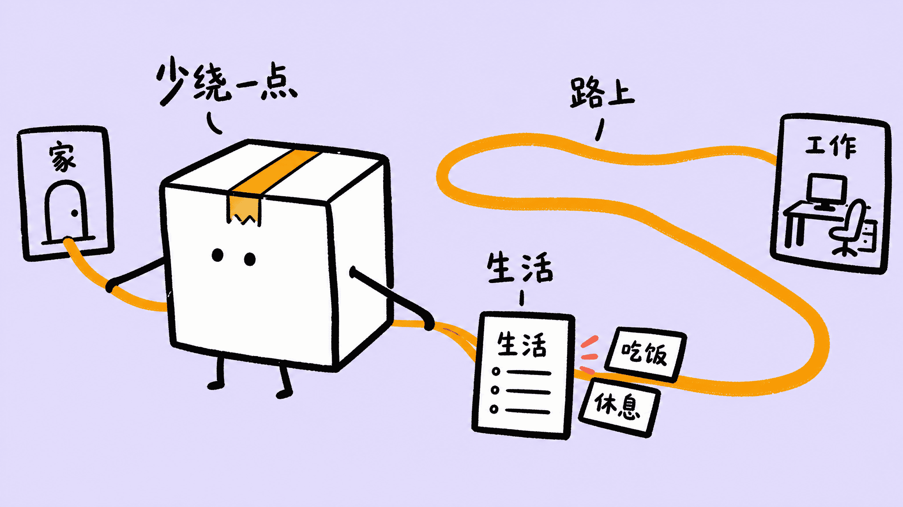

# 5km Littlebox Illustrations

> 把文章里的判断、流程、风险、方法和隐喻，变成一张张克制、怪诞、手绘感强的“小盒”正文配图。
>
> 16:9 横版为主 | 小盒 IP | 合盖纸盒小人 | 粗黑马克笔 | 浅天蓝 / 浅薰衣草紫背景 | Codex Skill

---

## 这个仓库是什么

`5km Littlebox Illustrations` 是一个 Codex Skill，用来指导 AI Agent 为中文文章、博客、产品思考、方法论笔记、热点评论和抽象概念生成正文配图。

它不是通用插画 prompt，也不是 PPT 信息图模板。它的目标是：先理解内容里的一个关键认知动作，再把它变成一张小盒正在“处理问题”的手绘解释图。

默认视觉 IP 是“小盒”：一个永远合盖的白色纸盒小人，正面三分之四视角，黑点眼睛，小短腿，两侧小细枝胳膊，顶部中央有一条琥珀色锯齿胶带。小盒不是可爱吉祥物，也不是装饰物，它必须承担画面里的核心动作。

一句话：**让 AI 不只是“配一张图”，而是把文章里的关键认知动作画出来。**

---

## 灵感来源

这个项目的 Skill 结构、文章配图工作流和“让 IP 承担核心动作”的思路，受到 Ian 的 [Ian Xiaohei Illustrations](https://github.com/helloianneo/ian-xiaohei-illustrations) 启发。

小黑的仓库把“文章理解 → 认知锚点 → IP 行动 → 手绘正文配图”这套模式做得很清楚，小盒是在这个思路上重新设计的一套独立 IP 和视觉规则：合盖纸盒、粗马克笔、浅色背景、琥珀色锯齿胶带、侧边小细枝胳膊。

感谢 Ian 和小黑项目提供的参考。这个仓库不会复制小黑 IP，也不会复刻它的示例构图；这里只继承那种“尊重文章、让图像真的解释一个观点”的创作方法。

---

## 安装

使用 `skills` CLI 安装：

```bash
npx skills add okooo5km/5km-littlebox-illustrations
```

如果只想安装这个 Skill：

```bash
npx skills add okooo5km/5km-littlebox-illustrations --skill 5km-littlebox-illustrations
```

安装后，在 Codex 里使用：

```text
Use $5km-littlebox-illustrations 为这篇文章设计并生成 5 张小盒正文配图。
```

也可以先只做规划：

```text
Use $5km-littlebox-illustrations 先不要生成图片。
请分析下面这篇文章哪里值得配图，输出 5 张左右的 shot list。

<粘贴文章>
```

---

## 适合谁用

适合：

- 写中文文章，需要正文配图的人
- 做产品思考、AI 工作流、方法论内容的人
- 想把抽象判断画成具体隐喻的人
- 想要一个简洁、有识别度、可长期复用的原创 IP 风格的人
- 用 Codex 做内容生产，希望稳定复用一套视觉语言的人

不适合：

- 想要精致商业插画、品牌 KV 或儿童绘本风格的人
- 想要传统 PPT 信息图、复杂架构图或密集流程图的人
- 想做可爱贴纸、表情包或拟人吉祥物的人
- 想把大量正文、长句解释或完整课程页塞进一张图里的人
- 需要严格可编辑矢量源文件的人

---

## 它会产出什么

默认输出：

- 16:9 横版正文配图
- 一篇文章的 4-7 张 shot list
- 每张图的放置位置、核心意思、视觉隐喻、小盒动作和中文标注建议
- 最终 PNG 图片，保存到 workspace 的 `assets/<article-slug>-littlebox/`

默认不输出：

- PPTX / PDF / Keynote
- SVG / HTML / Canvas 可编辑图
- 商业海报或封面 KV
- 大段文字型信息图

---

## 视觉风格

这个 Skill 默认使用“小盒”手绘正文配图风格：

- 浅天蓝 `#E3F2FD` 或浅薰衣草紫 `#E6E6FA` 平面背景
- 黑色粗马克笔线条，干刷质感，边缘粗糙
- 小盒永远合盖，不开盖、不半开、不剖面
- 小盒白色盒身，黑点眼睛，小短腿，两侧小细枝胳膊
- 顶部中央只有一条琥珀色锯齿胶带
- 珊瑚红只用于警告、盖章、错误或强调
- 中文标签短、少、手写感强
- 大量留白，一张图只表达一个核心动作
- 小盒必须参与核心动作，不能只是站在旁边

---

## 用法案例

下面这些案例展示的是“怎么把一句文章观点交给 Skill”，以及它会如何把观点变成小盒正在执行的动作。它们是风格校准样例，不是构图模板；真正使用时应该根据当前文章重新发明隐喻。

### 01 技术债利息

适合内容：工程复盘、技术债、架构治理、重构成本。

可复制 prompt：

```text
Use $5km-littlebox-illustrations 为“技术债不是坏代码本身，而是每次赶工留下的未支付利息”生成一张 16:9 正文配图。
小盒保持合盖，用两侧小细枝胳膊把“临时修”纸片从一堆旧补丁里分拣出来。
可见中文标签只用：“临时修”、“旧坑”、“利息”、“重构”。
```

图像重点：小盒把“临时修”从旧补丁堆里抽出来，强调债务来自反复延后处理。



### 02 通胀压力篮

适合内容：经济学解释、消费观察、家庭预算、价格压力。

可复制 prompt：

```text
Use $5km-littlebox-illustrations 为“通胀不是一个抽象数字，而是不同人篮子里的不同压力”生成一张 16:9 正文配图。
小盒保持合盖，把价格标签分拣进三个外部小篮子。注意：小盒只能有左右两条侧缝小细枝胳膊，第三类标签必须通过外部托盘或路径进入，不能多长一只手。
可见中文标签只用：“房租”、“食品”、“工资”、“压力”。
```

图像重点：小盒只用两只胳膊处理标签，第三类压力通过外部托盘表达，避免 IP 变形。



### 03 拖延不是懒

适合内容：心理学、效率方法、任务拆解、自我管理。

可复制 prompt：

```text
Use $5km-littlebox-illustrations 为“拖延往往不是懒，而是任务太模糊”生成一张 16:9 正文配图。
小盒保持合盖，一只侧缝胳膊从黑线团里拉出线索，另一只侧缝胳膊只放一张行动卡；其他行动卡放在外部托盘里，不要画分叉胳膊。
可见中文标签只用：“太大”、“下一步”、“现在做”、“先一个”。
```

图像重点：模糊任务被拆成一个可以开始的小动作，小盒不靠多手臂完成分拣。



### 04 合同小字

适合内容：法律风险、服务条款、商业合作、签约提醒。

可复制 prompt：

```text
Use $5km-littlebox-illustrations 为“合同里最危险的东西，经常藏在最小的字里”生成一张 16:9 正文配图。
小盒保持合盖，把角落里的“小字条款”拽到画面中央。
可见中文标签只用：“合同”、“小字”、“责任”、“签前看”。
```

图像重点：小盒把被忽略的小字拉到中央，让风险从背景变成主角。


### 05 生态边界

适合内容：生态、可持续、资源消耗、系统边界。

可复制 prompt：

```text
Use $5km-littlebox-illustrations 为“生态系统不是仓库，不能只取不补”生成一张 16:9 正文配图。
小盒保持合盖，用两侧小细枝胳膊把资源纸片从裂开的生态盘边缘移回来。
可见中文标签只用：“资源”、“边界”、“恢复”、“别超载”。
```

图像重点：小盒把资源从裂缝边缘拉回，表达系统有边界，不能无限取用。



### 06 家庭开销漏点

适合内容：个人理财、家庭预算、消费习惯、订阅管理。

可复制 prompt：

```text
Use $5km-littlebox-illustrations 为“钱不是突然没的，而是从很多看不见的小漏点流走的”生成一张 16:9 正文配图。
小盒保持合盖，用两侧小细枝胳膊堵住外部钱包漏口，并把收据分到几个小堆。
可见中文标签只用：“订阅”、“外卖”、“冲动买”、“先看见”。
```

图像重点：小盒先让漏点可见，再把开销归类，适合更大众的生活类文章。



### 07 症状搜索别下结论

适合内容：健康科普、搜索习惯、信息判断、风险提醒。

可复制 prompt：

```text
Use $5km-littlebox-illustrations 为“症状搜索最危险的地方，是把可能性当结论”生成一张 16:9 正文配图。
小盒保持合盖，用两侧小细枝胳膊拦住从“可能是”滑向“自己诊断”的路径，并把方向引到“问医生”。
可见中文标签只用：“可能是”、“自己诊断”、“问医生”、“别下结论”。
```

图像重点：小盒把“可能性”和“结论”隔开，提醒读者不要把搜索结果当诊断。



### 08 育儿建议筛选

适合内容：亲子、母婴、经验分享、家庭决策。

可复制 prompt：

```text
Use $5km-littlebox-illustrations 为“母婴建议太多，真正需要的是筛选，而不是全信”生成一张 16:9 正文配图。
小盒保持合盖，用两侧小细枝胳膊扶住外部筛网，把建议卡筛成“证据”和“先问”两摞。
可见中文标签只用：“经验”、“证据”、“先问”、“适合我吗”。
```

图像重点：画面避开幼稚贴纸风，用筛网表达“经验可以参考，但要过一遍”。


### 09 通勤吞掉生活

适合内容：城市生活、通勤、工作节奏、时间管理。

可复制 prompt：

```text
Use $5km-littlebox-illustrations 为“长通勤不只是花时间，它会挤走生活里安静的小块”生成一张 16:9 正文配图。
小盒保持合盖，用两侧小细枝胳膊把过长的通勤线从日程卡旁拉开。
可见中文标签只用：“路上”、“工作”、“生活”、“少绕一点”。
```

图像重点：小盒拉开过长路线，把被挤压的生活小块重新露出来。



示例图均为 Zipic 压缩后的 PNG。保留 PNG 是为了保护手写标签和粗黑笔触，避免 JPEG 压缩让线条发糊。

---

## 怎么用

### 只做配图规划

```text
Use $5km-littlebox-illustrations 先不要生图。
请分析下面这篇文章哪里值得配图，输出 5 张左右的 shot list。
每张图写清楚：
- 放在哪段后
- 主题
- 核心意思
- 小盒状态
- 视觉隐喻
- 建议元素
- 建议中文标注词

<粘贴文章>
```

### 直接生成正文配图

```text
Use $5km-littlebox-illustrations 把下面这篇文章生成 4 张小盒正文配图。
要求：16:9 横版、浅天蓝和浅薰衣草紫背景均衡、粗黑马克笔、少量琥珀色和珊瑚红中文手写标注。

<粘贴文章>
```

### 为单个概念生成一张图

```text
Use $5km-littlebox-illustrations 为这个观点生成一张正文配图：

信任不是一句口号，而是一包被保存好的小证据。

小盒必须承担核心动作，画面要怪诞但清楚。
```

### 为热点讽刺生成静态图

```text
Use $5km-littlebox-illustrations 为“AI 把概率答案说得太自信，而现实风险没人兜底”生成一张 21:9 静态讽刺图。
小盒保持合盖，用两侧小细枝胳膊把“仅供参考”从角落拽到中央。
```

更多示例见 [examples/prompts.md](examples/prompts.md)。

---

## 更多主题例子

小盒适合处理各种学科和主题。关键不是“画什么物件”，而是让小盒做一个具体动作：拦住、封存、分拣、压缩、移交、求证、隔离、修复。

| 领域 | 主题 | 小盒动作 | 可见标签 |
| --- | --- | --- | --- |
| 计算机科学 | 技术债为什么会越滚越大 | 把补丁纸片压进一个快裂开的外部文件夹 | `临时修`、`旧坑`、`重构` |
| AI 产品 | 模型答案需要人类校验 | 把“自信回答”拽回求证台 | `像真的`、`先求证`、`别直接用` |
| 经济学 | 通胀不是一个数字，是一篮子压力 | 把价格标签分拣进不同篮子 | `房租`、`食品`、`工资` |
| 心理学 | 拖延来自任务太模糊 | 把一团黑线拆成三张小卡 | `太大`、`下一步`、`开工` |
| 教育 | 刷题和理解之间有断点 | 把题海纸片拦在“理解桥”前 | `会做`、`会讲`、`迁移` |
| 医疗健康 | 养生建议不能替代诊断 | 把偏方纸条盖上红色警告章 | `偏方`、`问医生`、`证据` |
| 法律 | 合同里的小字决定风险 | 把小字条从角落拖到中央 | `例外`、`责任`、`签前看` |
| 历史 | 一个时代不是单线进步 | 把时间线折成多条分岔路径 | `选择`、`代价`、`回声` |
| 社会学 | 热搜把复杂问题压成一句话 | 把巨大标题拆成几张背景卡 | `一句话`、`背景`、`谁受影响` |
| 城市规划 | 通勤时间吞掉生活 | 把地铁线从日程盒旁拉开 | `路上`、`工作`、`生活` |
| 生态 | 过度开发会让系统失衡 | 把资源纸片从裂开的生态盘边缘移走 | `边界`、`恢复`、`别超载` |
| 亲子 | 母婴建议太多，真正需要的是筛选 | 把建议卡分成“可试”和“先问”两摞 | `经验`、`证据`、`适合我吗` |

更多可直接复制的跨学科 prompt 见 [examples/theme-prompts.md](examples/theme-prompts.md)。

---

## 工作流程

这个 Skill 的流程是：

1. 读取文章、Markdown、截图、链接或用户给的主题
2. 提炼单个最强洞察、认知转折、流程结构或失败点
3. 先输出 shot list：每张图只选一个认知锚点
4. 为每张图选择浅天蓝或浅薰衣草紫背景，并保持多图数量均衡
5. 重新发明一个低科技、怪诞但成立的物理隐喻
6. 让小盒在合盖状态下承担核心动作
7. 每张图单独调用图像模型生成
8. 按 quality gate 检查：合盖、胶带、胳膊、留白、中文标注、非 PPT 感
9. 保存最终 PNG，并报告路径

---

## 目录结构

```text
.
├── README.md
├── LICENSE
├── NOTICE.md
├── examples/
│   ├── images/
│   │   ├── 01-tech-debt-interest.png
│   │   ├── 02-economics-inflation-baskets.png
│   │   ├── 03-psychology-procrastination-clarity.png
│   │   ├── 04-law-contract-small-print.png
│   │   ├── 05-ecology-system-boundary.png
│   │   ├── 06-household-spending-leaks.png
│   │   ├── 07-health-search-maybe.png
│   │   ├── 08-parenting-advice-filter.png
│   │   └── 09-commute-eats-life.png
│   ├── prompts.md
│   └── theme-prompts.md
└── 5km-littlebox-illustrations/
    ├── SKILL.md
    ├── agents/
    │   └── openai.yaml
    └── references/
        ├── visual-language.md
        ├── littlebox-ip.md
        ├── composition-methods.md
        ├── language-and-labels.md
        ├── prompt-template.md
        ├── quality-gate.md
        └── examples.md
```

真正需要安装到 Codex 的是子目录：

```text
5km-littlebox-illustrations/
```

根目录的 README、LICENSE、NOTICE 和 examples 是 GitHub 分享文档。

---

## 注意事项

- 小盒必须合盖。不要开盖、半开、剖面或露出内部。
- 琥珀色胶带只能作为小盒顶部中央身份胶带，不能乱贴到盒身或其他物体上。
- 小盒的胳膊必须从两侧盒缝伸出，不能从正面、眼睛或盖子长出来。
- 图片里的中文文字越短越稳定。
- 每张图只讲一个核心结构，不要把文章做成说明书。
- 小盒必须承担核心动作；如果去掉小盒画面仍然完全成立，说明小盒太装饰了。
- 示例图只用于校准线条密度、留白、颜色克制和小盒参与方式，不要复刻构图。
- AI 图像模型可能出现错字、幻觉标签、风格漂移或多余标题，生成后需要检查。
- 如果中文错字严重，优先减少标注词并重生成。

---

## 作者

**okooo5km（十里）**

- GitHub: [okooo5km](https://github.com/okooo5km)
